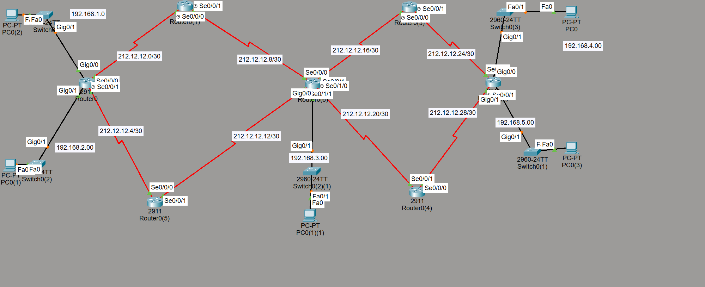

# 🚀 Cisco Packet Tracer - Maquettes de Routage Dynamique :

Ce dépôt contient trois architectures réseau distinctes réalisées sur **Cisco Packet Tracer**, illustrant la mise en œuvre des principaux protocoles de routage dynamique : **RIPv2**, **OSPF** et **EIGRP**.

## 📋 Présentation du Projet
L'objectif est de démontrer la connectivité complète (Full Mesh) entre plusieurs réseaux locaux (LAN) à travers une infrastructure de routeurs interconnectés par des liaisons série (/30).

### 🛠️ Technologies Utilisées
- **Logiciel** : Cisco Packet Tracer
- **Protocoles** : RIPv2, OSPF, EIGRP
- **Adressage** : IPv4 (VLSM)
- **Équipements** : Routeurs 2911, Switches 2960, PCs

---

## 🏗️ Les 3 Maquettes

### 1. Maquette RIP (Routing Information Protocol)
*Le protocole à vecteur de distance, simple et efficace pour les petites topologies.*
- **Version** : 2 (Supporte le VLSM)
- **Configuration Clé** : `no auto-summary` pour éviter la résumérisation automatique.
- **Vérification** : `show ip route rip`

### 2. Maquette OSPF (Open Shortest Path First)
*Le standard de l'industrie basé sur l'état des liens.*
- **Algorithme** : Dijkstra (SPF)
- **Hiérarchie** : Utilisation de l'**Area 0** (Backbone).
- **Configuration Clé** : Wildcard masks précis (`0.0.0.3`) pour les liens série.
- **Vérification** : `show ip ospf neighbor`

### 3. Maquette EIGRP (Enhanced Interior Gateway Routing Protocol)
*Le protocole hybride propriétaire Cisco à convergence ultra-rapide.*
- **AS (Autonomous System)** : 10
- **Algorithme** : DUAL (Diffusing Update Algorithm).
- **Configuration Clé** : Utilisation de masques génériques pour une précision optimale.
- **Vérification** : `show ip eigrp neighbors`

---

## 🚀 Installation et Test

1. Téléchargez le fichier `.pkt` correspondant au protocole souhaité.
2. Ouvrez le fichier dans **Cisco Packet Tracer**.
3. Pour tester la connectivité :
   - Utilisez l'outil **Ping** entre les PCs des extrémités.
   - Utilisez la commande `traceroute` pour visualiser le chemin emprunté par les paquets.
4. Pour inspecter le routage :
   - Accédez au CLI d'un routeur et tapez `show ip route`.

---

## 🔍 Comparaison des Protocoles

| Protocole | Type | Distance Administrative | Convergence |
| :--- | :--- | :--- | :--- |
| **RIPv2** | Vecteur de distance | 120 | Lente |
| **OSPF** | État des liens | 110 | Rapide |
| **EIGRP** | Hybride | 90 | Très rapide |

---

## ✍️ Auteur
**Moad** - Étudiant en Cybersécurité et Technologie Web.
